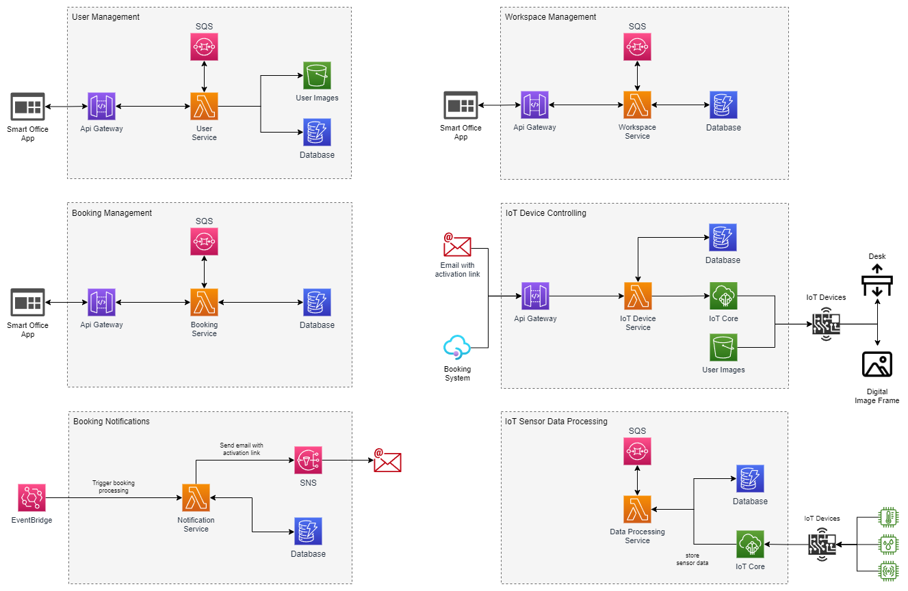

  
  <h1  align="center">Smart Office</h1>

## Table of Contents

- [Motivation](#motivation)
- [Architectur](#architectur)
- [Built with](#builtwith)
- [Run the simulator](#runthesimulator)

## Motivation 

At the latest since the Corona crisis, there has been increased talk of co-working, desk sharing and office space reduction. Especially in offices with a high degree of digitalization, it was very easy to send the entire workforce to the home office and still keep the business running. Because of the associated savings in heating, electricity, water, cleaning, etc., many companies are sticking with offering home offices and achieving permanent reductions in operating costs.

For all the efficiency and cost savings, shared workspaces also come with some drawbacks. The personal touch as well as the ability to customize one's own workspace is lost. For example, desks that can be adjusted in height are always adapted to the needs and preferences of the predecessor. Personal pictures or objects usually have to be dispensed with. Another disadvantage is the choice of desk itself. Even if employees are literally free to choose where they want to work, the same workstations are usually chosen. Getting used to a new office structure every day and looking for a suitable workplace where efficient and undisturbed work is possible can be a major challenge. Aspects such as room temperature, light levels, noise levels, or simply proximity to the nearest coffee machine, can all play a role in choosing the optimal workstation. Common booking systems for managing shared desk workstations, while enabling their reservation, do not provide data on users' booking behavior.

With our solution, employees get the opportunity to customize their temporary workspace. Each workstation is equipped with an IoT device through which a stored user profile is applied. For example, the height adjustment of the desk is automatically adjusted or the display of a digital picture frame is controlled.
User-dependent settings are activated by means of facial recognition or control by an external system. In addition to this individualization of the shared workspace, the built-in sensors of the IoT device collect data on room temperature, light irradiation or noise level and transmit it to our cloud service. From there, this information can be retrieved and further processed by external systems. By correlating this data with the booking behavior of employees, unused workstations and the possible reasons for their avoidance can be uncovered, analyzed and remedied. The chosen solution approach represents the beginning of an entire ecosystem that can be expanded at will. In this way, control of heating, ventilation, air-conditioning or lighting systems can be implemented at a later stage.

(<a href="#readme-top">back to top</a>)

## Architectur 

The "Smart Office" application is implemented as a native cloud solution using a microservice architecture in \ac{aws} and mainly consists of the following services and components:

* **User Management:** Microservice for managing user information
* **Workspace Management:** Microservice for managing workspace information
* **Booking Management:** Microservice for managing workspace reservations
* **Booking Notification:** Microservice that sends notifications to users
* **IoT Sensor Data Processing:** Microservice that processes the recorded sensor data from the IoT devices
* **IoT Device Controlling:** Microservice for controlling IoT devices
* **IoT Device:** IoT Device with sensors for controlling a workstation and collecting data

The graphic below shows the different application parts of the Smart Office environment:

  

By using the microservice design pattern, the services of the "Smart Office" can be divided into small independent units, which contributes to better scalability as well as flexibility in the implementation of each individual service. In combination with Infrastructure as Code , this approach also helps to ensure that the individual services can be provided independently of one another. Each of the services is implemented in AWS as a standalone Lambda function. Data storage is in a relational database, assets such as user images for display in a workstation's digital picture frame are stored in AWS S3. Communication with the "Smart Office" microservices is done through a REST interface and an upstream Amazon API gateway.

(<a href="#readme-top">back to top</a>)

## Built with 

- [Visual Studio](https://visualstudio.microsoft.com/de/vs/community/)
- [Net Core](https://dotnet.microsoft.com/)
- [Windows Presentation Foundation](https://learn.microsoft.com/en-us/dotnet/desktop/wpf/overview/)
- [AWS IoT Core](https://aws.amazon.com/de/iot-core/)
- [MahApps.Metro](https://mahapps.com/)
- [Castle Windsor](http://www.castleproject.org/)
- [MQTTnet](https://github.com/dotnet/MQTTnet) 
- [Raspberry PI](https://www.raspberrypi.com/)

(<a href="#readme-top">back to top</a>)
